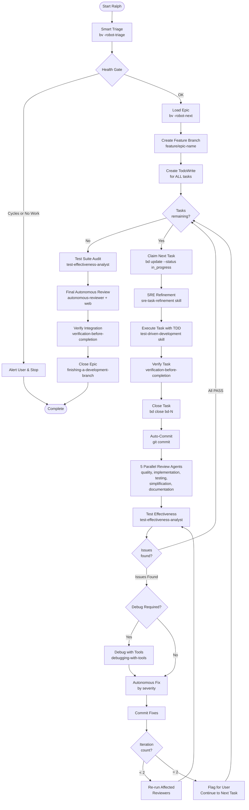

<!-- Generated from skills/execute-ralph/SKILL.md -->



<skill_overview>
Execute complete epic without STOP checkpoints. Production-grade pipeline per task: SRE refinement → TDD execution → verification gates → auto-commit → 5 parallel review agents → test effectiveness analysis → autonomous fixes with debugging tools (max 2 iterations). At end: comprehensive test suite audit → autonomous final review with web research → verification → branch completion. Combines the rigor of execute-plans with full hyperpowers capabilities (debugging, root-cause tracing, test quality analysis, verification gates).
</skill_overview>

<rigidity_level>
MEDIUM FREEDOM - Follow the execution loop strictly. Adapt to reviewer feedback autonomously. Epic requirements remain immutable. Tasks adapt to reality.
</rigidity_level>

<quick_reference>

| Phase | Action | Outcome |
|-------|--------|---------|
| **0. Setup** | Smart triage + create branch + permission check | Ready for autonomous execution |
| **1. Refine** | SRE refinement per task | Task ready with edge cases covered |
| **2. Execute** | TDD per task → auto-commit | Task implemented and committed |
| **3. Review** | 5 parallel review agents + test effectiveness | Issues collected |
| **4. Fix** | Autonomous fix with debugging (max 2 iterations) | Issue resolved or flagged |
| **5. Loop** | Repeat 1-4 for all tasks | All tasks done |
| **6. Audit** | Test suite audit + autonomous review | Final validation |
| **7. Complete** | Branch completion | Epic closed |

**Review Agents:**
- Phase 3: quality, implementation, testing, simplification, documentation (5 parallel)
- Phase 4: test-effectiveness-analyst (tautology detection, coverage gaming)
- Phase 9: autonomous-reviewer with web research (most capable model)

**Agent Model Configuration:**
| Agent | Recommended Model | Reason |
|-------|------------------|--------|
| test-runner | Fast (haiku, glm-4.5) | High-volume, low-complexity |
| review-quality, review-implementation | Capable (sonnet, glm-4.7) | Requires reasoning |
| test-effectiveness-analyst | Capable (sonnet, glm-4.7) | Complex analysis |
| autonomous-reviewer | Most capable (opus, glm-4.7) | Final validation with research |

</quick_reference>

<when_to_use>

**Use when:**
- Epic is well-defined with clear success criteria
- User trusts autonomous execution
- Tasks are straightforward implementation
- User wants hands-off execution

**Do NOT use when:**
- Epic has ambiguous requirements (use execute-plans instead)
- User wants checkpoint reviews between tasks
- High-risk changes needing human oversight per task
- Experimental/exploratory work

</when_to_use>

<the_process>

## Phase 0: Smart Triage & Branch Setup

### Step 0a: Get Smart Triage

```bash
bv -robot-triage 2>/dev/null
```

Parse JSON to understand:
- `triage.quick_ref.actionable_count` - How many items ready
- `triage.quick_ref.top_picks` - Best items by score
- `triage.blockers_to_clear` - High-impact blockers
- `triage.project_health.graph.has_cycles` - Dependency health

### Step 0b: Health Gate

**STOP and alert user only if:**
- `has_cycles: true` → Dependency cycles detected
- `actionable_count: 0` → Nothing to work on

**Otherwise:** Continue autonomously

### Step 0c: Load Top Pick & Create Branch

```bash
bv -robot-next 2>/dev/null  # Get optimal next task
```

Run `show_command` to load full details. If type is "epic":

**Create feature branch from epic title:**
```bash
# Convert epic title to branch name (lowercase, hyphens, no special chars)
BRANCH_NAME=$(echo "[epic-title]" | tr '[:upper:]' '[:lower:]' | tr ' ' '-' | tr -cd 'a-z0-9-')
git checkout -b "feature/${BRANCH_NAME}"
```

Example: "User Authentication Flow" → `feature/user-authentication-flow`

```bash
bd dep tree bd-xxx  # Understand task structure
```

**Extract:**
- Requirements (IMMUTABLE)
- Success criteria (validation checklist)
- Anti-patterns (FORBIDDEN shortcuts)
- All tasks and dependencies

**Create TodoWrite for ALL tasks upfront:**
```
Branch: feature/[epic-name]
- bd-2: [title] (pending)
- bd-3: [title] (pending)
- bd-4: [title] (pending)
```

## Phase 1: SRE Refinement (Per Task)

Before executing ANY task, run SRE refinement to ensure it's ready:

```bash
bv -robot-next 2>/dev/null  # Get optimal next task with claim_command
```

Then claim and load:
```bash
bd update bd-N --status in_progress   # Use claim_command from robot-next
bd show bd-N                          # Load details
```

**Run SRE Task Refinement:**
```
Use Skill tool: hyperpowers:sre-task-refinement
```

This ensures:
- Task granularity is appropriate (4-8 hours)
- Edge cases and failure modes are identified
- Success criteria are specific and measurable
- No placeholder text remains
- Anti-patterns are specified
- Test specifications catch real bugs

If SRE refinement finds critical issues:
- Update the task using `bd update --design`
- Re-run SRE refinement if major changes made
- Only proceed to execution when task passes review

## Phase 2: Execute Task

**Execute using TDD:**
- Use `test-driven-development` skill for implementation
- Use `test-runner` agent for verifications (keeps context clean)
- Complete ALL substeps before closing

**Auto-close task after verification:**
```bash
# Run verification commands internally
# Then auto-close
bd close bd-N
```

### Step 2b: Auto-Commit

After each task completion, commit changes:

```bash
git add -A
git commit -m "Complete bd-N: [task title]

- [Brief summary of what was implemented]
- Tests: passing

Part of epic: bd-1 - [epic title]"
```

**Update TodoWrite:**
```
Branch: feature/[epic-name]
Commits: 1
- bd-2: [title] ✓ (committed)
- bd-3: [title] (in progress)
- bd-4: [title] (pending)
```

→ Proceed to Phase 3 (NO STOP, continue autonomously)

## Phase 3: Multi-Agent Parallel Review

Dispatch **5 review agents in parallel** for comprehensive coverage:

```
Dispatch IN PARALLEL:

1. review-quality:
   "Review task bd-N implementation for bugs, security issues, race conditions.
   Task: [title]
   Files changed: [list]
   Return: PASS or ISSUES_FOUND with severity and file:line references."

2. review-implementation:
   "Verify task bd-N achieves its stated goals.
   Task requirements: [from bd show]
   Epic requirements: [relevant subset]
   Return: PASS or ISSUES_FOUND with missing/incomplete items."

3. review-testing:
   "Evaluate test coverage for task bd-N changes.
   Files changed: [list]
   Test files: [list]
   Return: PASS or ISSUES_FOUND with coverage gaps."

4. review-simplification:
   "Check for over-engineering in task bd-N.
   Task scope: [what was requested]
   Implementation: [what was built]
   Return: PASS or ISSUES_FOUND with simplification recommendations."

5. review-documentation:
   "Check if docs need updates for task bd-N changes.
   Changes: [API changes, config changes, new features]
   Return: PASS or ISSUES_FOUND with documentation gaps."
```

### Collecting Results

Wait for all 5 agents. Aggregate issues:

```
Review Results for bd-N:
- Quality: PASS
- Implementation: PASS
- Testing: ISSUES_FOUND (1 MAJOR)
- Simplification: PASS
- Documentation: ISSUES_FOUND (1 MINOR)

Issues to Address:
1. [MAJOR/testing] No test for error case in handler.ts:45
2. [MINOR/docs] New env var not documented in README
```

### If All PASS

→ Continue to next task (Phase 1) autonomously

### If Any ISSUES_FOUND

→ Proceed to Phase 4 (Autonomous Fix)

## Phase 4: Autonomous Fix (Max 2 Iterations)

**Run test-effectiveness-analyst in parallel with other reviewers:**

```
Dispatch IN PARALLEL:
1. review-quality
2. review-implementation
3. review-testing
4. review-simplification
5. review-documentation
6. test-effectiveness-analyst
```

**If issues found, fix autonomously without user interaction:**

**Iteration tracking:**
```
- bd-N fix iteration: 1/2
```

**Prioritize fixes by severity:**
1. CRITICAL issues first
2. MAJOR issues second  
3. MINOR issues (best effort)
4. Test effectiveness issues (tautologies, weak assertions)

**For complex fixes (3+ independent issues):**
```
Use Skill tool: hyperpowers:dispatching-parallel-agents
```

Dispatch agents in parallel (one per independent domain):
- Each agent fixes one issue category
- Must verify independence first
- Wait for all agents, check conflicts
- Run full test suite before continuing

**For each issue:**
1. Read the specific file:line reference
2. Apply the fix instruction exactly
3. Run tests via test-runner

**After fixes applied:**
```bash
git add -A
git commit -m "Fix review issues for bd-N (iteration 1)

- [List of issues fixed]"
```

**Re-run affected reviewers AND test-effectiveness-analyst:**
- If testing issue fixed → re-run review-testing + test-effectiveness-analyst
- If quality issue fixed → re-run review-quality
- etc.

**Outcomes:**
- If all PASS: continue to next task (Phase 1 - SRE Refinement)
- If still ISSUES_FOUND and iteration < 2: repeat Phase 6
- If still ISSUES_FOUND and iteration = 2: flag for user, continue to next task

**Flagging format:**
```
FLAGGED FOR USER REVIEW:
- Task: bd-N
- Unfixed Issues:
  1. [MAJOR/testing] description
  2. [MINOR/docs] description
- Attempted fixes: 2 iterations
- Recommendation: [what user should check]
```

## Phase 7: Task Loop

Repeat Phases 1-6 until:
- All tasks closed, OR
- Critical blocker encountered

**Critical blocker criteria:**
- Cannot compile after 2 fix iterations
- Test suite completely broken
- Epic anti-pattern unavoidable
- Debugging tools cannot identify root cause

If critical blocker: stop loop, proceed to Phase 10 with blocker documented.

## Phase 8: Test Suite Audit

After all tasks complete, run comprehensive test effectiveness audit:

```
Use Skill tool: hyperpowers:analyzing-test-effectiveness
```

**This will:**
- Inventory all tests in the codebase
- Read production code before categorizing
- Identify RED tests (tautological, mock-testing, line hitters)
- Identify YELLOW tests (weak assertions, coverage gaming)
- Assess GREEN tests (meaningful, catch real bugs)
- Find missing corner cases
- Create bd epic with improvement tasks if needed

**Purpose:** Establish baseline test quality for the epic.

## Phase 9: Final Autonomous Review

After all tasks complete, run **2-agent critical review** (quality + implementation only):

```
Dispatch IN PARALLEL:

1. review-quality:
   "FINAL REVIEW for epic bd-1.
   Focus: CRITICAL and MAJOR issues only.
   Scope: All changes in this epic.

   Epic: [title]
   All tasks completed: [list]

   Look for:
   - Security vulnerabilities across the full implementation
   - Integration issues between tasks
   - Race conditions in combined code paths

   Return: APPROVED or CRITICAL_ISSUES with specific fixes needed."

2. review-implementation:
   "FINAL REVIEW for epic bd-1.
   Focus: CRITICAL gaps only.

   Epic requirements: [full list]
   Completed tasks: [list]

   Verify:
   - ALL success criteria are actually met
   - No requirements were lost between tasks
   - Integration is complete

   Return: APPROVED or CRITICAL_ISSUES with missing requirements."
```

### If Both APPROVED

→ Proceed to Phase 6

### If CRITICAL_ISSUES

Create remediation tasks:
```bash
bd create "Remediation: [issue description]" \
  --type task \
  --design "[fix instructions from reviewer]"
bd dep add bd-NEW bd-1 --type parent-child
```

Execute remediation tasks (return to Phase 1).

**Safety limit:** Max 3 remediation rounds. If still issues after 3 rounds, flag for user and complete.

## Phase 7: Branch Completion

**Use finishing-a-development-branch skill:**

```
Use Skill tool: hyperpowers:finishing-a-development-branch
```

**This skill:**
1. Closes bd epic: `bd close bd-1`
2. Verifies tests pass
3. Determines base branch
4. Executes merge/PR automatically (or presents options if ambiguous)
5. Cleans up worktree

**NO WAITING** - Execute completion autonomously unless merge conflicts detected.

Present summary:

```markdown
## Epic bd-1 Complete - Autonomous Execution

### Branch
`feature/[epic-name]` - Ready for PR

### Statistics
- Total tasks: N
- Total commits: M
- Fix iterations: X
- Review agents invoked: Y (5 standard + test-effectiveness-analyst per task)
- Tests audited: Z (test effectiveness analysis)
- Debug sessions: W (debugging-with-tools invocations)
- Tautological tests caught: T
- Root causes traced: R (via root-cause-tracing)

### Tasks Executed
- bd-2: [title] ✓
- bd-3: [title] ✓ (1 fix iteration)
- bd-4: [title] ✓

### Review Summary
**Per-Task Reviews (5 agents + test-effectiveness-analyst each):**
- bd-2: All PASS (5 agents + test quality PASS)
- bd-3: 3 issues found (2 standard + 1 tautological test), fixed in 1 iteration
- bd-4: All PASS (5 agents + test quality PASS)

**Test Effectiveness Audit:**
- RED tests removed: N
- YELLOW tests strengthened: M
- GREEN tests verified: X
- Missing corner cases added: Y

**Final Review (autonomous-reviewer with web research):**
- Status: APPROVED
- Security scan: No vulnerabilities found
- Architecture: Coherent
- Performance: Within expected parameters

### Issues Fixed Autonomously
1. [MAJOR/testing] Missing error case test - added test
2. [MINOR/docs] Undocumented env var - updated README
3. [MAJOR/test-eff] Tautological test removed and replaced with meaningful test
4. [MAJOR/debug] Root cause identified via debugging-with-tools - fixed at source

### Flagged for User Review
- [Any items that couldn't be resolved after 2 fix iterations]
- [Or "None - all issues resolved autonomously"]

### Next Steps
Branch completion options presented via finishing-a-development-branch:
1. Merge locally to [base-branch]
2. Push and create Pull Request
3. Keep branch as-is
4. Discard work

[Or "Epic complete - awaiting user choice on integration method"]
```

</the_process>

<critical_rules>

## Rules That Have No Exceptions

1. **Epic requirements are IMMUTABLE** - Never water down to make execution easier
2. **SRE refinement REQUIRED per task** - Never skip corner-case analysis before execution
3. **Verification gate REQUIRED** - Use verification-before-completion before closing ANY task
4. **Test effectiveness analysis REQUIRED** - Run test-effectiveness-analyst after 5-agent review
5. **Debug systematically** - Use debugging-with-tools when root cause unclear
6. **Max 2 fix iterations per task** - After 2, flag and continue
7. **Max 3 remediation rounds** - After 3, complete with flags
8. **Max 10 tasks per execution** - Safety limit to prevent runaway
9. **Always use test-runner** - Keep verbose output out of context
10. **Always run all 5 reviewers + test-effectiveness-analyst** - Full review coverage
11. **Always auto-commit** - Each task completion gets its own commit
12. **Always create branch** - Never work directly on main
13. **Final verification REQUIRED** - verification-before-completion before epic close

## What Triggers User Notification

Only these situations stop autonomous execution:
- Critical blocker (can't compile, tests completely broken, debugging can't find root cause)
- 10 task limit reached
- 3 remediation rounds exhausted

Everything else: fix autonomously and continue.

**Special case - Debug loop:**
If debugging-with-tools or root-cause-tracing cannot identify root cause after thorough investigation, alert user with findings so far.

## Anti-Patterns for This Skill

- Skipping SRE refinement "task looks straightforward"
- Skipping verification-before-completion gates
- Skipping test-effectiveness-analyst "tests look fine"
- Skipping debugging tools "I'll just guess the fix"
- Skipping reviewers "because task was simple"
- Skipping TDD "to save time"
- Ignoring reviewer feedback
- Continuing past critical blockers
- Not using web search when uncertain
- Not using root-cause-tracing for deep errors
- Working on main branch instead of feature branch
- Not committing after task completion

</critical_rules>

<integration>

**This skill calls:**
- sre-task-refinement (REQUIRED before executing each task)
- test-driven-development (for implementing each task)
- verification-before-completion (REQUIRED gates)
- test-runner (for running tests without output pollution)
- review-quality (parallel reviewer)
- review-implementation (parallel reviewer)
- review-testing (parallel reviewer)
- review-simplification (parallel reviewer)
- review-documentation (parallel reviewer)
- test-effectiveness-analyst (tautology/coverage gaming detection)
- debugging-with-tools (systematic debugging)
- root-cause-tracing (deep error tracing)
- dispatching-parallel-agents (for 3+ independent fixes)
- analyzing-test-effectiveness (final test suite audit)
- autonomous-reviewer (final review with web research)
- finishing-a-development-branch (branch completion)

**This skill is called by:**
- User via `/hyperpowers:execute-ralph`
- After writing-plans creates well-defined epic

**Comparison to execute-plans:**

| Aspect | execute-plans | execute-ralph |
|--------|---------------|---------------|
| Checkpoints | STOP after each task | No stops |
| SRE Refinement | Per new task | **Per every task** |
| Verification gates | Per task | **Per task + final gate** |
| Debug tools | On failure | **Systematic debugging** |
| Test effectiveness | Not included | **Per task + final audit** |
| Parallel fixes | Not included | **For 3+ independent issues** |
| Final review | review-implementation | **autonomous-reviewer + web** |
| Branch completion | Manual | **finishing-a-development-branch** |
| User interaction | Required between tasks | Only on failure |
| Review | Final only | 5 agents + test-effectiveness per task |
| Git workflow | Manual | Auto-branch + auto-commit |
| Best for | Uncertain requirements | Well-defined epics with full hyperpowers pipeline |

**Comparison to ralphex:**

| Aspect | ralphex | execute-ralph |
|--------|---------|---------------|
| Multi-agent review | Yes 5 parallel | Yes 5 + test-effectiveness-analyst |
| Test quality analysis | No | **Yes - per task + final audit** |
| Debug tools integration | No | **Yes - debugging-with-tools** |
| Root cause tracing | No | **Yes - root-cause-tracing** |
| Verification gates | No | **Yes - verification-before-completion** |
| Parallel fix dispatch | No | **Yes - dispatching-parallel-agents** |
| Autonomous reviewer | No | **Yes - with web research** |
| Branch completion | Basic | **finishing-a-development-branch** |
| Git branch | Yes Auto | Yes Auto |
| Auto-commit | Yes | Yes |
| Final review | Yes 2 agents | Yes autonomous-reviewer |
| Smart triage | No | Yes bv robot-* |
| bd integration | No | Yes Full |
| Web dashboard | Yes | No CLI only |

</integration>

<resources>

**bd command reference:**
- See [bd commands](../common-patterns/bd-commands.md)

**Review agents:**
- review-quality: bugs, security, race conditions
- review-implementation: requirements verification
- review-testing: test coverage and quality
- review-simplification: over-engineering detection
- review-documentation: docs update needs

**When stuck:**
- 2 fix iterations failed → Flag and continue, let user review later
- Critical blocker → Stop, document clearly, present summary
- Reviewers keep finding issues → Check if epic requirements are realistic

</resources>
