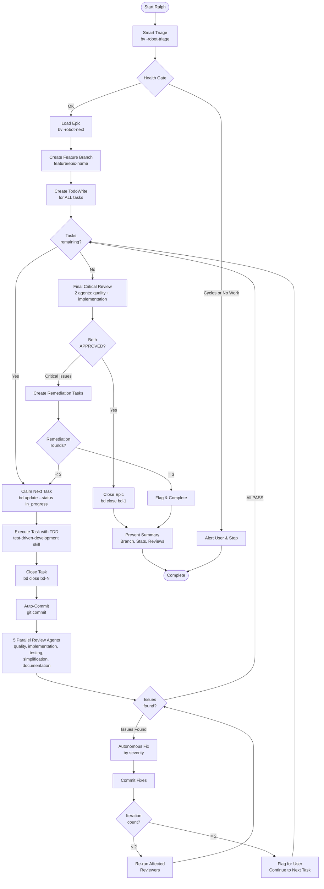

<skill_overview>
Execute complete epic without STOP checkpoints. Creates feature branch from epic name. After each task: auto-commit + 5 parallel review agents. If issues found: fix autonomously (max 2 iterations). At end: 2-agent critical-only review. Only presents summary when all tasks complete or on critical failure.
</skill_overview>

<rigidity_level>
MEDIUM FREEDOM - Follow the execution loop strictly. Adapt to reviewer feedback autonomously. Epic requirements remain immutable. Tasks adapt to reality.
</rigidity_level>

<quick_reference>

| Phase | Action | Outcome |
|-------|--------|---------|
| **0. Setup** | Smart triage + create branch | Branch created, epic loaded |
| **1. Execute** | TDD per task, test-runner verification | Task implemented |
| **1b. Commit** | Auto-commit completed task | Changes saved |
| **2. Review** | 5 parallel review agents | Issues collected |
| **3. Fix** | If issues: fix, re-review (max 2x) | Issue resolved or flagged |
| **4. Loop** | Repeat 1-3 for all tasks | All tasks done |
| **5. Final** | 2-agent critical-only review | APPROVED or GAPS_FOUND |
| **6. Complete** | Close epic, archive | User sees summary |

**Review Agents:**
- Phase 2: quality, implementation, testing, simplification, documentation (5 parallel)
- Phase 5: quality, implementation only (2 critical)

</quick_reference>

<when_to_use>

**Use when:**
- Epic is well-defined with clear success criteria
- User trusts autonomous execution
- Tasks are straightforward implementation
- User wants hands-off execution

**Do NOT use when:**
- Epic has ambiguous requirements (use execute-plans instead)
- User wants checkpoint reviews
- High-risk changes needing human oversight
- Experimental/exploratory work

</when_to_use>

<the_process>

## Phase 0: Smart Triage & Branch Setup

### Step 0a: Get Smart Triage

```bash
bv -robot-triage 2>/dev/null
```

Parse JSON to understand:
- `triage.quick_ref.actionable_count` - How many items ready
- `triage.quick_ref.top_picks` - Best items by score
- `triage.blockers_to_clear` - High-impact blockers
- `triage.project_health.graph.has_cycles` - Dependency health

### Step 0b: Health Gate

**STOP if any:**
- `has_cycles: true` → Alert user about dependency cycles
- `actionable_count: 0` → Nothing to work on

### Step 0c: Load Top Pick & Create Branch

```bash
bv -robot-next 2>/dev/null  # Get optimal next task
```

Run `show_command` to load full details. If type is "epic":

**Create feature branch from epic title:**
```bash
# Convert epic title to branch name (lowercase, hyphens, no special chars)
BRANCH_NAME=$(echo "[epic-title]" | tr '[:upper:]' '[:lower:]' | tr ' ' '-' | tr -cd 'a-z0-9-')
git checkout -b "feature/${BRANCH_NAME}"
```

Example: "User Authentication Flow" → `feature/user-authentication-flow`

```bash
bd dep tree bd-xxx  # Understand task structure
```

**Extract:**
- Requirements (IMMUTABLE)
- Success criteria (validation checklist)
- Anti-patterns (FORBIDDEN shortcuts)
- All tasks and dependencies

**Create TodoWrite for ALL tasks upfront:**
```
Branch: feature/[epic-name]
- bd-2: [title] (pending)
- bd-3: [title] (pending)
- bd-4: [title] (pending)
```

## Phase 1: Execute Task

For the next ready task, use smart triage:

```bash
bv -robot-next 2>/dev/null  # Get optimal next task with claim_command
```

Then claim and load:
```bash
bd update bd-N --status in_progress   # Use claim_command from robot-next
bd show bd-N                          # Load details
```

**Execute using TDD:**
- Use `test-driven-development` skill for implementation
- Use `test-runner` agent for verifications
- Complete ALL substeps before closing

```bash
bd close bd-N  # After implementation complete
```

### Step 1b: Auto-Commit

After each task completion, commit changes:

```bash
git add -A
git commit -m "Complete bd-N: [task title]

- [Brief summary of what was implemented]
- Tests: passing

Part of epic: bd-1 - [epic title]"
```

**Update TodoWrite:**
```
Branch: feature/[epic-name]
Commits: 1
- bd-2: [title] ✓ (committed)
- bd-3: [title] (in progress)
- bd-4: [title] (pending)
```

→ Proceed to Phase 2

## Phase 2: Multi-Agent Parallel Review

Dispatch **5 review agents in parallel** for comprehensive coverage:

```
Dispatch IN PARALLEL:

1. review-quality:
   "Review task bd-N implementation for bugs, security issues, race conditions.
   Task: [title]
   Files changed: [list]
   Return: PASS or ISSUES_FOUND with severity and file:line references."

2. review-implementation:
   "Verify task bd-N achieves its stated goals.
   Task requirements: [from bd show]
   Epic requirements: [relevant subset]
   Return: PASS or ISSUES_FOUND with missing/incomplete items."

3. review-testing:
   "Evaluate test coverage for task bd-N changes.
   Files changed: [list]
   Test files: [list]
   Return: PASS or ISSUES_FOUND with coverage gaps."

4. review-simplification:
   "Check for over-engineering in task bd-N.
   Task scope: [what was requested]
   Implementation: [what was built]
   Return: PASS or ISSUES_FOUND with simplification recommendations."

5. review-documentation:
   "Check if docs need updates for task bd-N changes.
   Changes: [API changes, config changes, new features]
   Return: PASS or ISSUES_FOUND with documentation gaps."
```

### Collecting Results

Wait for all 5 agents. Aggregate issues:

```
Review Results for bd-N:
- Quality: PASS
- Implementation: PASS
- Testing: ISSUES_FOUND (1 MAJOR)
- Simplification: PASS
- Documentation: ISSUES_FOUND (1 MINOR)

Issues to Address:
1. [MAJOR/testing] No test for error case in handler.ts:45
2. [MINOR/docs] New env var not documented in README
```

### If All PASS

Log review result, continue to next task (Phase 1).

### If Any ISSUES_FOUND

→ Proceed to Phase 3

## Phase 3: Autonomous Fix (Max 2 Iterations)

**Iteration tracking:**
```
- bd-N fix iteration: 1/2
```

**Prioritize fixes by severity:**
1. CRITICAL issues first
2. MAJOR issues second
3. MINOR issues (best effort)

**For each issue:**
1. Read the specific file:line reference
2. Apply the fix instruction exactly
3. Run tests via test-runner

**After fixes applied:**
```bash
git add -A
git commit -m "Fix review issues for bd-N (iteration 1)

- [List of issues fixed]"
```

**Re-run affected reviewers only:**
- If testing issue fixed → re-run review-testing
- If quality issue fixed → re-run review-quality
- etc.

**Outcomes:**
- If all PASS: continue to next task
- If still ISSUES_FOUND and iteration < 2: repeat Phase 3
- If still ISSUES_FOUND and iteration = 2: flag for user, continue to next task

**Flagging format:**
```
FLAGGED FOR USER REVIEW:
- Task: bd-N
- Unfixed Issues:
  1. [MAJOR/testing] description
  2. [MINOR/docs] description
- Attempted fixes: 2 iterations
- Recommendation: [what user should check]
```

## Phase 4: Task Loop

Repeat Phases 1-3 until:
- All tasks closed, OR
- Critical blocker encountered

**Critical blocker criteria:**
- Cannot compile after 2 fix iterations
- Test suite completely broken
- Epic anti-pattern unavoidable

If critical blocker: stop loop, proceed to summary with blocker documented.

## Phase 5: Final Critical-Only Review

After all tasks complete, run **2-agent critical review** (quality + implementation only):

```
Dispatch IN PARALLEL:

1. review-quality:
   "FINAL REVIEW for epic bd-1.
   Focus: CRITICAL and MAJOR issues only.
   Scope: All changes in this epic.

   Epic: [title]
   All tasks completed: [list]

   Look for:
   - Security vulnerabilities across the full implementation
   - Integration issues between tasks
   - Race conditions in combined code paths

   Return: APPROVED or CRITICAL_ISSUES with specific fixes needed."

2. review-implementation:
   "FINAL REVIEW for epic bd-1.
   Focus: CRITICAL gaps only.

   Epic requirements: [full list]
   Completed tasks: [list]

   Verify:
   - ALL success criteria are actually met
   - No requirements were lost between tasks
   - Integration is complete

   Return: APPROVED or CRITICAL_ISSUES with missing requirements."
```

### If Both APPROVED

→ Proceed to Phase 6

### If CRITICAL_ISSUES

Create remediation tasks:
```bash
bd create "Remediation: [issue description]" \
  --type task \
  --design "[fix instructions from reviewer]"
bd dep add bd-NEW bd-1 --type parent-child
```

Execute remediation tasks (return to Phase 1).

**Safety limit:** Max 3 remediation rounds. If still issues after 3 rounds, flag for user and complete.

## Phase 6: Completion

Close epic:
```bash
bd close bd-1
```

Final commit (if any uncommitted changes):
```bash
git add -A
git commit -m "Complete epic bd-1: [epic title]

All tasks completed and reviewed.
Final review: APPROVED"
```

Present comprehensive summary:

```markdown
## Epic bd-1 Complete - Autonomous Execution

### Branch
`feature/[epic-name]` - Ready for PR

### Statistics
- Total tasks: N
- Total commits: M
- Fix iterations: X
- Review agents invoked: Y

### Tasks Executed
- bd-2: [title] ✓
- bd-3: [title] ✓ (1 fix iteration)
- bd-4: [title] ✓

### Review Summary
**Per-Task Reviews (5 agents each):**
- bd-2: All PASS
- bd-3: 2 issues found, fixed in 1 iteration
- bd-4: All PASS

**Final Review (2 agents):**
- Quality: APPROVED
- Implementation: APPROVED

### Issues Fixed Autonomously
1. [MAJOR/testing] Missing error case test - added test
2. [MINOR/docs] Undocumented env var - updated README

### Flagged for User Review
- [Any items that couldn't be resolved]
- [Or "None - all issues resolved autonomously"]

### Next Steps
- Review branch `feature/[epic-name]`
- Create PR when ready
- [Or "Epic complete, no further action needed"]
```

</the_process>

<critical_rules>

## Rules That Have No Exceptions

1. **Epic requirements are IMMUTABLE** - Never water down to make execution easier
2. **Max 2 fix iterations per task** - After 2, flag and continue
3. **Max 3 remediation rounds** - After 3, complete with flags
4. **Max 10 tasks per execution** - Safety limit to prevent runaway
5. **Always use test-runner** - Keep verbose output out of context
6. **Always run all 5 reviewers** - Every task gets full review, no skipping
7. **Always auto-commit** - Each task completion gets its own commit
8. **Always create branch** - Never work directly on main

## What Triggers User Notification

Only these situations stop autonomous execution:
- Critical blocker (can't compile, tests completely broken)
- 10 task limit reached
- 3 remediation rounds exhausted

Everything else: fix autonomously and continue.

## Anti-Patterns for This Skill

- Skipping reviewers "because task was simple"
- Skipping TDD "to save time"
- Ignoring reviewer feedback
- Continuing past critical blockers
- Not using web search when uncertain
- Working on main branch instead of feature branch
- Not committing after task completion

</critical_rules>

<integration>

**This skill calls:**
- test-driven-development (for implementing each task)
- test-runner (for running tests without output pollution)
- review-quality (parallel reviewer)
- review-implementation (parallel reviewer)
- review-testing (parallel reviewer)
- review-simplification (parallel reviewer)
- review-documentation (parallel reviewer)

**This skill is called by:**
- User via `/hyperpowers:execute-ralph`
- After writing-plans creates well-defined epic

**Comparison to execute-plans:**

| Aspect | execute-plans | execute-ralph |
|--------|---------------|---------------|
| Checkpoints | STOP after each task | No stops |
| User interaction | Required between tasks | Only on failure |
| Review | Final only | 5 agents per task + 2 final |
| Git workflow | Manual | Auto-branch + auto-commit |
| Best for | Uncertain requirements | Well-defined epics |

**Comparison to ralphex:**

| Aspect | ralphex | execute-ralph |
|--------|---------|---------------|
| Multi-agent review | Yes 5 parallel | Yes 5 parallel |
| Git branch | Yes Auto | Yes Auto |
| Auto-commit | Yes | Yes |
| Final review | Yes 2 agents | Yes 2 agents |
| Smart triage | No | Yes bv robot-* |
| bd integration | No | Yes Full |
| Web dashboard | Yes | No CLI only |

</integration>

<resources>

**bd command reference:**
- See [bd commands](../common-patterns/bd-commands.md)

**Review agents:**
- review-quality: bugs, security, race conditions
- review-implementation: requirements verification
- review-testing: test coverage and quality
- review-simplification: over-engineering detection
- review-documentation: docs update needs

**When stuck:**
- 2 fix iterations failed → Flag and continue, let user review later
- Critical blocker → Stop, document clearly, present summary
- Reviewers keep finding issues → Check if epic requirements are realistic

</resources>
