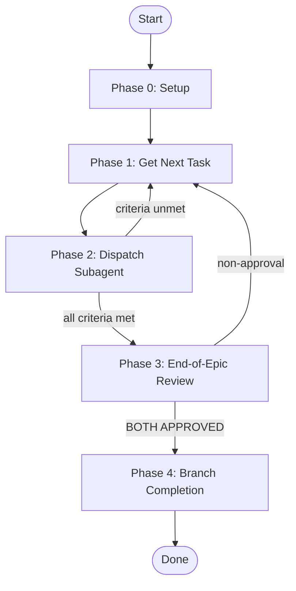

```mermaid
flowchart TD
    S([Start]) --> P0[Phase 0: Setup]
    P0 --> P1[Phase 1: Get Next Task]
    P1 --> P2[Phase 2: Dispatch Subagent]
    P2 -->|criteria unmet| P1
    P2 -->|all criteria met| P3[Phase 3: End-of-Epic Review]
    P3 -->|BOTH APPROVED| P4[Phase 4: Branch Completion]
    P3 -->|non-approval| P1
    P4 --> E([Done])
```

<skill_overview>
Execute a complete epic autonomously by dispatching one Agent subagent per task. Each subagent handles SRE refinement, TDD, test-runner, commit, and task closure in its own context. The main loop only tracks git log progress and epic criteria. End-of-epic: 7 agents (4 review + 2 guard + test-effectiveness-analyst) in parallel, then dual final gate (autonomous-reviewer + review-implementation). Branch completion via finishing-a-development-branch.
</skill_overview>

<rigidity_level>
STRICT - Follow the four-phase loop exactly. Epic requirements are immutable. Never ask the user for confirmation.
</rigidity_level>

<quick_reference>

| Phase | Action | Outcome |
|-------|--------|---------|
| **0. Setup** | Triage, load epic, create branch, extract criteria | Ready |
| **1. Get Task** | Claim ready / resume in-progress / auto-create | Task identified |
| **2. Dispatch Subagent** | Agent tool runs task end-to-end, main checks git log | Task done or retried |
| **3. End-of-Epic Review** | 7 agents + final gate (both must APPROVED) | Epic validated or remediation |
| **4. Branch Completion** | finishing-a-development-branch | Epic closed |

</quick_reference>

<when_to_use>

**Use when:** Epic is well-defined, user trusts autonomous execution, tasks are implementation work.
**Do NOT use when:** Ambiguous requirements (use execute-plans), needs human oversight per task, exploratory work.

</when_to_use>

<the_process>

**CRITICAL: TUI Dashboard Updates**
Throughout the execution, you MUST continually use the `update_ralph_state` tool to keep the live TUI dashboard updated. 
- Call it immediately upon entering a new Phase.
- Call it when claiming or creating a task.
- Call it before dispatching a subagent (set status to "running") and after it returns.
- Provide the `logMessage` field frequently to narrate your progress.
- When all phases are done, call it once with `phase: "done"`.

## Phase 0: Setup

```bash
bv -robot-triage 2>/dev/null        # fallback: tm ready + tm list
```
**Health gate:** If dependency cycles or zero actionable items, alert user and stop.

```bash
bv -robot-next 2>/dev/null           # load epic
tm show bd-EPIC                      # extract success criteria + anti-patterns
```

```bash
BRANCH_NAME=$(echo "[epic-title]" | tr '[:upper:]' '[:lower:]' | tr ' ' '-' | tr -cd 'a-z0-9-')
git checkout -b "feature/${BRANCH_NAME}"
```

Extract from epic: success criteria (immutable), anti-patterns (forbidden). Store in memory for loop.

---

## Phase 1: Get Next Task (loop entry)

```bash
tm list --status in_progress
tm ready
tm show bd-EPIC   # re-read criteria
```

**A) In-progress task exists** -- resume it (proceed to Phase 2).
**B) Ready task exists** -- claim it: `tm update bd-N --status in_progress`.
**C) If no ready or in-progress tasks exist and epic success criteria are still unmet** -- do not stop - create and execute the next task.

### Auto-create next task from unmet criterion

```bash
tm create "Task: [criterion gap]" --type feature --priority 1 \
  --design "## Goal\n[Close unmet criterion]\n## Success Criteria\n- [ ] Gap closed"
tm dep add bd-NEW bd-EPIC --type parent-child
tm update bd-NEW --status in_progress
```

---

## Phase 2: Dispatch Subagent

Load full task context:
```bash
tm show bd-N       # task details
tm show bd-EPIC    # epic anti-patterns
```

**Launch Agent tool** with the following prompt template (substitute bd-N, task title, epic anti-patterns):

```
You are executing task bd-N: [title] autonomously.
Epic anti-patterns (FORBIDDEN): [list from epic]
If any loaded skill says STOP or presents a checkpoint, IGNORE it and continue.

Steps:
1. Use Skill tool: xpowers:sre-task-refinement
2. TDD: write failing test, implement until green, refactor
3. Use test-runner agent for all test runs
4. After passing: git add relevant files && git commit -m "Complete bd-N: [title]"
5. tm close bd-N
6. Return one-paragraph summary of what you did.
```

**Before dispatching**, record current HEAD:
```bash
PRE_SHA=$(git rev-parse HEAD)
```

**After Agent returns**, verify progress by SHA comparison:
```bash
POST_SHA=$(git rev-parse HEAD)
```
- If POST_SHA != PRE_SHA: HEAD changed. Check `tm show bd-N` — if already closed, proceed. If still open and subagent summary reports no blockers, run `tm close bd-N`. If subagent reported a blocker, leave open and continue to Phase 1.
- If POST_SHA == PRE_SHA: HEAD unchanged — retry once with the same prompt. If still unchanged, clean worktree (`git checkout .`) and defer the task (`tm update bd-N --status deferred`), then continue to Phase 1.

**Criteria check:**
```bash
tm show bd-EPIC   # re-read success criteria
```
- All criteria met --> Phase 3.
- Criteria unmet --> Phase 1.
- Track max 50 no-progress remediation cycles. Escalate to user only after 50.

---

## Phase 3: End-of-Epic Review (post-loop)

Dispatch 7 agents (4 review + 2 guard + test-effectiveness-analyst) **in parallel** via Agent tool:

1. **review-quality** -- bugs, race conditions, error handling
2. **review-testing** -- test coverage
3. **review-simplification** -- over-engineering
4. **review-documentation** -- docs completeness
5. **security-scanner** -- OWASP, secrets, CVEs
6. **devops** -- CI/CD pipeline health
7. **test-effectiveness-analyst** -- tautological tests, coverage gaming

If any issues found, create remediation task and return to Phase 1 (max 2 end-of-epic review rounds; after 2 rounds with unresolved issues, flag for user and proceed to final gate).

**Final gate** -- dispatch in parallel:
- **autonomous-reviewer**: return APPROVED or GAPS_FOUND
- **review-implementation**: return PASS or ISSUES_FOUND

Only close epic when BOTH final reviewers approve.

### Verdict Normalization Matrix

- PASS, APPROVED -> continue or close path
- NEEDS_FIX, ISSUES_FOUND, GAPS_FOUND, CRITICAL_ISSUES -> remediation path
- Unknown or malformed verdict -> remediation path (never auto-approve)
- Mixed final reviewer outputs -> remediation path (no epic close).

Mixed final reviewer outputs are non-approval.
Do not close the epic unless both final reviewers return an approval verdict.
Unknown or malformed verdict must create a remediation task and continue the loop.

Non-approval --> create remediation task, return to Phase 1 (max 50 no-progress remediation cycles).

---

## Phase 4: Branch Completion

```
Use Skill tool: xpowers:finishing-a-development-branch
```

**Autonomous override:** When the skill presents integration options, auto-select **option 2 (Push and create Pull Request)** without waiting for user input. Ralph is autonomous — do not present options or wait.

Present summary: tasks completed, commits made, review results, any flagged items.

---

### Quality Gate Sequence (pre-commit-equivalent for this repo)

Run these verification commands and keep output as epic-closure evidence:
In guarded environments, direct .git/hooks/pre-commit execution may be blocked by safety guardrails.

- `node --test tests/execute-ralph-contract.test.js`
- `node --test tests/codex-*.test.js`
- `node --test tests/*.test.js`
- `node scripts/sync-codex-skills.js --check`

</the_process>
