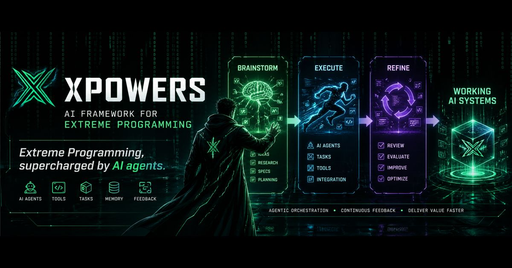

<p align="center">
  
</p>

<h1 align="center">XPowers</h1>

<p align="center">
  <strong>Structured engineering workflows for Claude Code, OpenCode, Gemini CLI, Kimi CLI, Codex CLI, and Pi.</strong>
</p>

<p align="center">
  <a href="LICENSE"></a>
  <a href=".claude-plugin/plugin.json"></a>
  <a href="https://claude.ai/code"></a>
  <a href="https://github.com/dpolishuk/xpowers/pulls"></a>
</p>

<p align="center">
  <a href="#quick-start">Quick Start</a> ·
  <a href="#why-xpowers">Why XPowers</a> ·
  <a href="#features">Features</a> ·
  <a href="#installation">Installation</a> ·
  <a href="#usage">Usage</a> ·
  <a href="#contributing">Contributing</a>
</p>

---

XPowers turns Claude Code, OpenCode, Gemini CLI, Kimi CLI, and Codex CLI into disciplined pair-programming partners. It adds reusable skills, specialized agents, safety hooks, and task-management workflows so your assistant plans before coding, verifies before claiming success, and keeps complex work moving without losing engineering rigor.

## Quick Start

### Claude Code

```text
/plugin marketplace add dpolishuk/xpowers
/plugin install xpowers@xpowers --scope user
```

### Universal installer (macOS / Linux)

```bash
curl -fsSL https://raw.githubusercontent.com/dpolishuk/xpowers/main/scripts/install.sh | bash
```

### Local installer

```bash
git clone https://github.com/dpolishuk/xpowers.git
cd xpowers
bun scripts/install.ts
```

**Conflict safety:** Before installing, XPowers checks for legacy or overlapping `hyperpowers`, `myhyperpowers`, and `superpowers` installs so multiple agent instruction systems do not fight each other. Remove detected conflicts first. Advanced users who intentionally keep both systems can pass `--allow-conflicts`, for example:

```bash
curl -fsSL https://raw.githubusercontent.com/dpolishuk/xpowers/main/scripts/install.sh | bash -s -- --allow-conflicts
```

Install docs for other hosts are in [Host-Specific Instructions](#host-specific-instructions), with standalone guides for [Kimi CLI](.kimi/INSTALL.md) and [Pi](docs/pi.md).

## Why XPowers

<table>
<tr>
<td width="33%">

### 🧭 Workflow guardrails
Skills encode proven development loops: brainstorm, plan, implement with TDD, review, and verify.

</td>
<td width="33%">

### 🤖 Specialist agents
Delegate research, testing, security scanning, code review, documentation review, and autonomous execution.

</td>
<td width="33%">

### 🛡️ Safer automation
Hooks block dangerous operations, protect secrets, track edits, and nudge verification before completion.

</td>
</tr>
</table>

## Task Management Model

XPowers is **tm-first**. `tm` is the canonical user-facing task-management interface for setup, task work, and sync workflows.

`tm` supports **one backend selected per project**. Backends are peers in the `tm` model, but `bd` / `br` / `tk` / `linear` are **not interchangeable day-to-day commands**:

- `tm` = canonical user-facing task-management interface
- `bd` = current local tracker backend in this repo
- `br` = Beads Rust, a classic SQLite+JSONL beads-compatible backend / migration option
- `tk` = Ticket, a git-backed markdown ticket workflow alternative
- `linear` = Linear-native backend preview (core commands only on this repo branch)

On this repo today, `bd` remains the active backend.

### tm Backend Interoperability

While `tm` provides a unified interface, some backends use different flag names or behaviors. `tm` translates these when possible.

| tm Flag | br Backend | bd Backend |
|---------|------------|------------|
| `--design` | `--description` | `--design` |
| `--design-file <file>` | `$(cat <file>)` passed to `--description` | `--design-file` |

This mapping currently applies to `tm create` with the `br` backend.

### Boundary: ralph-tui / beads-rust Skills

Some global skills outside this repo can generate task sources for `ralph-tui` using beads-rust (`br`). Those workflows are explicitly backend-specific. Inside XPowers project work, agents must use `tm` unless the user explicitly asks for `ralph-tui`, `beads-rust`, or `br` task-source generation.

## Features

### Skills

Reusable workflows that make AI coding sessions repeatable and reviewable.

| Category | Skills |
|----------|--------|
| **Feature development** | `brainstorming`, `writing-plans`, `executing-plans`, `execute-ralph`, `review-implementation`, `finishing-a-development-branch`, `sre-task-refinement` |
| **Debugging** | `debugging-with-tools`, `root-cause-tracing`, `fixing-bugs` |
| **Quality & testing** | `test-driven-development`, `testing-anti-patterns`, `analyzing-test-effectiveness`, `verification-before-completion` |
| **Refactoring** | `refactoring-diagnosis`, `refactoring-design`, `refactoring-safely`, `managing-bd-tasks` |
| **Collaboration** | `dispatching-parallel-agents`, `writing-skills`, `building-hooks`, `skills-auto-activation` |

### Slash Commands

```text
/xpowers:brainstorm              Refine an idea before coding
/xpowers:write-plan              Create detailed implementation tasks
/xpowers:execute-plan            Execute tasks with review checkpoints
/xpowers:execute-ralph       - Execute epic autonomously (no stops)
/xpowers:review-implementation   Verify work against requirements
/xpowers:refactor-diagnose       Identify refactor targets
/xpowers:refactor-design         Design a safe refactor
/xpowers:refactor-execute        Execute a test-preserving refactor
/xpowers:analyze-tests           Audit test effectiveness
/xpowers:version                 Show plugin version
```

### Specialized Agents

| Agent family | Agents | Purpose |
|--------------|--------|---------|
| **Research & planning** | `codebase-investigator`, `internet-researcher`, `knowledge-aggregator`, `planner` | Understand code, docs, APIs, and architecture options |
| **Execution** | `test-runner`, `ralph`, `code-reviewer` | Run tests cleanly, execute autonomously, and review implementations |
| **Parallel review** | `review-quality`, `review-implementation`, `review-testing`, `review-simplification`, `review-documentation`, `security-scanner`, `devops` | Catch defects, requirement gaps, missing tests, over-engineering, docs gaps, security issues, and CI problems |
| **Advanced analysis** | `test-effectiveness-analyst`, `autonomous-reviewer` | Audit tests and produce machine-facing final validation |

See [Model Configuration](docs/model-configuration.md) to route providers and models per agent.

### Pi Support

XPowers includes first-class Pi support via `.pi/extensions/xpowers/`:

- routed `xpowers_subagent` execution
- extension-managed `/review-parallel`
- shared Pi task runner with `single`, `parallel`, and `chain` execution modes
- fresh and forked subprocess contexts
- advisory `metadata.pi` skill frontmatter parsing
- authoritative model routing via `/routing-settings`

See [`docs/pi.md`](docs/pi.md) for details.

### Hooks

- **Automatic skill activation** suggests relevant workflows from user prompts.
- **Safety hooks** block destructive commands, secret-file writes, and sensitive direct reads.
- **Context tracking** records edits during a session.
- **Stop reminders** encourage TDD, verification, and clean commits.

See [HOOKS.md](HOOKS.md) for configuration and troubleshooting.

## How Ralph Works

**Ralph** (`execute-ralph`) is XPowers' autonomous epic executor.

```text
Setup → Execute Task (TDD) → Multi-Agent Review → Auto-Fix → Next Task → Final Review → Done
```

| Aspect | `/xpowers:execute-plan` | `/xpowers:execute-ralph` |
|--------|--------------------------|---------------------------|
| User interaction | Stops after each task | Stops only on critical failure |
| Review points | Final review | Per-task review + final review |
| Auto-commit | Manual | After every task |
| Git branch | Manual | Auto-created from epic name |
| Best for | Uncertain or high-risk work | Well-defined epics you trust |

Safety limits include capped fix iterations, capped remediation rounds, a task execution ceiling, auto-branch creation, and immutable epic requirements.

## Key Benefits

- **Context efficiency** — noisy test output stays in worker-agent context.
- **Structured workflows** — skills enforce planning, TDD, review, and verification.
- **Multi-agent review** — specialized reviewers find issues in parallel.
- **Safe autonomy** — Ralph operates with hard limits and branch isolation.

## Installation

### For AI Agents (non-interactive)

If you are an AI agent installing this plugin, use the non-interactive installer:

```bash
# Install to all detected hosts with all features
bun scripts/install.ts --yes

# Install to specific hosts
bun scripts/install.ts --yes --hosts claude,opencode

# Install Pi only
bun scripts/install.ts --yes --hosts pi

# Install with specific features
bun scripts/install.ts --yes --hosts claude --features memsearch,statusline

# Install Pi with memsearch support
bun scripts/install.ts --yes --hosts pi --features memsearch

# JSON output for parsing
bun scripts/install.ts --yes --json

# Uninstall
bun scripts/install.ts --uninstall
```

Available hosts: `claude`, `opencode`, `kimi`, `gemini`, `pi`
Available features: `memsearch`, `supermemory`, `statusline`, `routing-wizard`, `tm-cli`

### For Humans (interactive TUI)

```bash
git clone https://github.com/dpolishuk/xpowers.git
cd xpowers
bun scripts/install.ts
```

The interactive installer auto-detects your AI tools and offers checkboxes for hosts and optional features (memory, routing, status line).

### Host-Specific Instructions

<details>
<summary><strong>Claude Code</strong></summary>

**Recommended: Install from GitHub**

```text
/plugin marketplace add dpolishuk/xpowers
/plugin install xpowers@xpowers --scope user
```

**Note for legacy installs:**

If you previously installed under the legacy name `withzombies-hyper`, uninstall it first:

```text
/plugin uninstall withzombies-hyper@withzombies-hyper
```

**Local development** (if you're contributing):

```text
claude --plugin-dir .
```

**From local clone:**

```text
/plugin marketplace add /absolute/path/to/xpowers
/plugin install xpowers@xpowers --scope user
```

**Migration from legacy plugin names:**

```text
/plugin uninstall withzombies-hyper@xpowers --scope user
/plugin uninstall xpowers@xpowers --scope user
/plugin install xpowers@xpowers --scope user
```

**Verify installation:**

```text
/help
# Should show /xpowers:* commands
```

</details>

<details>
<summary><strong>Pi</strong></summary>

### Prerequisites

- [Pi](https://github.com/mariozechner/pi-coding-agent) installed and available on your `PATH`
- `bun` (recommended) or `npm` for extension dependency installation

### Install

**Option A: One-command install (macOS / Linux)**
The fastest way to install or upgrade the Pi extension (requires `bun`):

```bash
curl -fsSL https://raw.githubusercontent.com/dpolishuk/xpowers/main/scripts/install.sh | bash -s -- --hosts pi --yes
```

**Option B: Install from cloned repo**
```bash
# Non-interactive Pi support
bun scripts/install.ts --yes --hosts pi

# Install with optional memory support (memsearch)
bun scripts/install.ts --yes --hosts pi --features memsearch
```

### What gets installed

The installer copies the XPowers Pi extension into:

```
~/.pi/agent/extensions/xpowers/    # Extension source (commands, tools, routing)
~/.pi/agent/extensions/xpowers/skills/    # Skill markdown files
~/.pi/agent/AGENTS.md                    # Updated with XPowers context
```

### Verify installation

Start a Pi session and check that XPowers commands are registered:

```text
/routing-settings       # Opens TUI routing wizard (or shows fallback in headless)
/review-parallel        # Runs multi-agent parallel review
/execute-ralph          # Autonomous epic execution
/brainstorm             # Interactive brainstorming
/help                   # Should list /xpowers:* commands
```

### Key Pi features

XPowers includes a dedicated Pi extension with:

- **Slash commands** — `/brainstorm`, `/write-plan`, `/execute-plan`, `/execute-ralph`, `/review-parallel`, `/routing-settings`, and more
- **Subagent tool** — `xpowers_subagent` for isolated subprocess delegation with model routing
- **Model routing** — configure per-agent model and effort via `/routing-settings` (stored in `~/.pi/agent/extensions/xpowers/routing.json`)
- **Routed effort** — effort levels map to Pi's `--thinking` flag
- **Parallel review** — real extension-managed `/review-parallel` fan-out/fan-in
- **Advisory skill metadata** — optional `metadata.pi` in skill frontmatter for subprocess hints

### Configure routing

```text
/routing-settings
```

Opens the Pi-native TUI wizard for configuring:
- Subagent type defaults (e.g., `review` → `anthropic/claude-sonnet-4-5`)
- Concrete agent overrides (e.g., `autonomous-reviewer` → `anthropic/claude-opus-4-5`)
- Routing presets

Config stored at `~/.pi/agent/extensions/xpowers/routing.json`.

### Uninstall

```bash
bun scripts/install.ts --uninstall --hosts pi --yes
```

### More info

See [docs/pi.md](docs/pi.md) for full Pi-specific usage, routing precedence, structured mode, and troubleshooting.

</details>

<details>
<summary><strong>OpenCode</strong></summary>

Quick start - run from the xpowers repo:

```bash
# Clone or navigate to xpowers
cd /path/to/xpowers

# Preferred path on this branch: install OpenCode support + shared tm runtime
./scripts/install.sh --opencode

# Run OpenCode (it auto-discovers opencode.json and .opencode/)
opencode
```

That's it! Commands, agents, skills, and the shared `tm` CLI used by this branch are now available.

**For your own projects**, copy these files:

```bash
cp opencode.json your-project/
cp -r .opencode your-project/
cd your-project/.opencode && bun install && cd ..
opencode
```

To generate a validated multi-agent routing config from live model names in the target project, run:

```bash
cd your-project
bun /path/to/xpowers/scripts/opencode-routing-wizard.ts --yes
```

**Install via npm** (alternative):

```json
// In your project's opencode.json
{
  "$schema": "https://opencode.ai/config.json",
  "plugin": ["@dpolishuk/xpowers-opencode"]
}
```

This npm path adds the OpenCode plugin package only. For this branch's installer-first `tm` + Linear workflow, use `./scripts/install.sh --opencode` so the shared tm runtime is provisioned as well.

**Verify:** `/xpowers-version`

</details>

<details>
<summary><strong>Gemini CLI</strong></summary>

Preferred path on this branch:

```bash
./scripts/install.sh --gemini
```

Fallback manual extension flow:

```bash
# Install or link the extension only
gemini extensions install .gemini-extension

# Reinstall with auto-update enabled
gemini extensions install .gemini-extension --auto-update

# Development workflow (loads edits immediately)
gemini extensions link .gemini-extension
```

Manual extension install/link is fallback-only here: it does **not** provision the shared `tm` runtime used by this branch's `tm sync` + optional Linear support.

If you had a prior local install, uninstall first:

```bash
gemini extensions uninstall xpowers
```

Verify: `gemini extensions list && gemini tools`

For full extension-specific installation and troubleshooting, see `.gemini-extension/README.md`.

</details>

<details>
<summary><strong>Kimi CLI</strong></summary>

Use the shared installer to provision Kimi support and the same tm-first workflow described throughout this branch:

```bash
./scripts/install.sh --kimi
```

Or install all detected hosts at once:

```bash
./scripts/install.sh --all
```

For Kimi-specific manual install, directory layout, and tm/Linear preview notes, see `.kimi/INSTALL.md`.

</details>

<details>
<summary><strong>Codex CLI</strong></summary>

Use the unified installer to install wrappers to `~/.codex/skills` (auto-syncs if needed):

```bash
./scripts/install.sh --codex
```

Or install to all detected agents at once:

```bash
./scripts/install.sh --all
```

Explicit invocation in Codex uses skill names (not custom slash-command registration):

```text
$codex-command-write-plan Draft a plan for feature X.
$codex-command-execute-plan Execute task bd-123.
$codex-skill-executing-plans Continue from current tm ready task.
```

You can also use `/skills` in Codex UI to discover and select the same wrappers.

</details>

<details>
<summary><strong>After Installation: Configure Models</strong></summary>

All agents use `model: inherit` by default, meaning they follow your current model selection.

**Quick setup - copy an example config:**

```bash
# For Anthropic Claude
cp docs/opencode.example.anthropic.json opencode.json

# For GLM models
cp docs/opencode.example.glm.json opencode.json

# Or use the minimal inherit-based config
cp docs/opencode.example.inherit.json opencode.json
```

See [Model Configuration](docs/model-configuration.md) for full documentation.

</details>

<details>
<summary><strong>Troubleshooting</strong></summary>

**OpenCode:**

| Issue | Solution |
|-------|----------|
| Commands not found | Ensure you're running `opencode` from a directory with `opencode.json` |
| Agents not working | Check that `.opencode/agents/*.md` files exist and have valid YAML frontmatter |
| Skills not loading | Run `bun install` in `.opencode/` directory |

**Claude Code:**

| Issue | Solution |
|-------|----------|
| Commands not showing | Run `/plugin list` to verify installation |
| Plugin not loading | Check `~/.claude/plugins/` for `xpowers@xpowers` directory |
| Hooks not firing | Restart Claude Code after installation |

**Getting help:** Open an issue at https://github.com/dpolishuk/xpowers/issues

**Updating:**

```text
# Claude Code
/plugin update xpowers@xpowers

# OpenCode: git pull in the xpowers directory
```

</details>

## Linear Integration (Optional)

XPowers includes a `tm` CLI as the canonical task-management interface. In this repo the current backend is `bd`, but day-to-day usage should remain tm-first.

Optionally, you can connect `tm sync` to [Linear](https://linear.app) to mirror your local issues to your team's Linear workspace.

### Quick Setup

1. **Get a Linear API key**: Linear Settings -> API -> Personal API keys -> Create key
2. **Find your team key**: Linear Settings -> Teams -> your team's short key (e.g., "ENG")
3. **Configure**:

```bash
# Option A: Environment variables
export LINEAR_API_KEY="lin_api_your_key_here"
export LINEAR_TEAM_KEY="ENG"

# Option B: Persistent config (per-repo)
tm config set linear.api-key "lin_api_your_key_here"
tm config set linear.team-key "ENG"
```

4. **Sync**: `tm sync` now pushes issues to Linear after syncing git

### Linear-Native Preview Backend

This branch also includes a minimal preview command surface for `TM_BACKEND=linear` when you want `tm` to talk directly to Linear instead of using local `bd` data as the primary store.

```bash
TM_BACKEND=linear tm ready
TM_BACKEND=linear tm list [--status <status>] [--parent <parent-ref>]
TM_BACKEND=linear tm show <linear-ref>
TM_BACKEND=linear tm update <linear-ref> --status <status>
TM_BACKEND=linear tm close <linear-ref>
```

- `<parent-ref>` may be either a Linear issue identifier (for example `ENG-123`) or a Linear internal id.
- Parent-scoped listing is currently limited to the preview backend command surface above; broader parity continues to land incrementally behind `tm`.

### Without Linear

If you don't configure Linear, the normal tm-first local workflow still works:

```
tm ready
tm show bd-42
tm sync
```

### Linear MCP Server (Optional)

For OpenCode, add a Linear MCP server to your project-root `opencode.json`:

```json
{
  "mcp": {
    "linear": {
      "type": "local",
      "command": ["npx", "-y", "@tacticlaunch/mcp-linear@1.0.12"],
      "environment": { "LINEAR_API_KEY": "{env:LINEAR_API_KEY}" }
    }
  }
}
```

See [docs/linear-mcp-setup.md](docs/linear-mcp-setup.md) for the full setup guide with host-specific examples, field mapping, troubleshooting, and architecture details.

## Uninstall

XPowers uses a manifest-based uninstaller that only removes files it installed -- your custom skills, agents, and hooks are safe.

```bash
# Preview what would be removed (no changes made)
./scripts/uninstall.sh --all --dry-run

# Uninstall from all agents
./scripts/uninstall.sh --all

# Uninstall from specific agent
./scripts/uninstall.sh --claude
./scripts/uninstall.sh --opencode
./scripts/uninstall.sh --kimi
./scripts/uninstall.sh --codex

# Complete removal (including backups and metadata)
./scripts/uninstall.sh --all --purge --yes
```

**Claude Code plugin:** `/plugin uninstall xpowers@xpowers --scope user`

See `./scripts/install.sh --help` for all options.

## Usage

### Getting Started

The `using-hyper` skill automatically loads at the start of each conversation and establishes core workflows. It ensures you:

1. Check for relevant skills before starting any task
2. Follow mandatory workflows (brainstorming before coding, TDD, verification)
3. Use TodoWrite for tracking checklist items
4. Announce which skills you're using

### Example Workflow

```
User: I need to add user authentication to my app

Claude: I'm using the brainstorming skill to refine your authentication requirements.
[Socratic questioning to understand requirements]

Claude: Now I'm using the writing-plans skill to create a detailed implementation plan.
[Creates detailed plan with specific tasks in tm-backed tracking]

Claude: I'm using the executing-plans skill to implement the tasks.
[Works through ready tasks continuously, using tm ready to find next task]

Claude: I'm using the test-runner agent to verify all tests pass.
[Agent runs tests, reports: "47 tests passed, 0 failed"]

Claude: I'm using the review-implementation skill to verify everything works.
[Reviews implementation against requirements]

Claude: I'm using the finishing-a-development-branch skill to wrap up.
[Creates PR, cleans up]
```

### Example: Using Ralph for Autonomous Execution

```
User: /xpowers:execute-ralph

Claude: I'll execute the current epic autonomously with continuous review.
[Creates feature branch]
[Executes Task 1 with TDD]
[5 review agents analyze Task 1]
[Fixes 2 minor issues autonomously]
[Commits Task 1]
[Executes Task 2...]
...
[Final critical review]
[Closes epic]

Claude: Epic complete! Summary:
- Branch: feature/user-authentication
- Tasks completed: 5
- Commits: 7 (including 2 fix commits)
- Review iterations: 2
- All success criteria met
```

## Philosophy

XPowers embodies several core principles:

- **Incremental progress over big bangs** - Small changes that compile and pass tests
- **Learning from existing code** - Study patterns before implementing
- **Explicit workflows over implicit assumptions** - Make the process visible
- **Verification before completion** - Evidence over assertions
- **Test-driven when possible** - Red, green, refactor
- **Autonomous execution with guardrails** - Trust but verify with multi-agent review

## Contributing

Contributions are welcome! This plugin is inspired by [obra/superpowers](https://github.com/obra/superpowers).

### Adding New Skills

1. Create a new directory in `skills/`
2. Add a `SKILL.md` file with the workflow
3. Follow the TDD approach in `writing-skills` skill
4. Test with subagents before deployment

### Adding New Agents

1. Create `agents/<agent-name>.md` with YAML frontmatter
2. Include `name`, `description`, and `model` fields
3. Document the agent's purpose and usage patterns

### Codex Skill Sync Pipeline

Codex-compatible wrappers are generated artifacts. The source of truth remains:

- `skills/*/SKILL.md`
- `commands/*.md`
- `agents/*.md`

Generated output is written to `.agents/skills`.

Run these commands after changing skills/commands/agents:

```bash
# Regenerate codex wrappers
node scripts/sync-codex-skills.js --write

# Verify generated wrappers are up to date (CI-friendly)
node scripts/sync-codex-skills.js --check
```

Description quality is validated during both `--write` and `--check`:

- Minimum quality bar: at least 20 characters and 5 words.
- Trigger/boundary wording required (for example: `use when`, `use to`, `if`, `before`, `after`, `do not`).
- Vague wording such as `helper`, `generic`, `misc`, or `stuff` is rejected.

Do not hand-edit generated `codex-*` skill directories; they are overwritten by sync.

### Unified Installer

All agents can be installed using the unified installer:

```bash
./scripts/install.sh --all        # Install to all detected agents
./scripts/install.sh --status     # Show install state per agent
./scripts/install.sh --help       # Full usage with all flags
./scripts/install.sh --uninstall --all  # Remove from all agents
```

Install to specific agents:

```bash
./scripts/install.sh --claude     # Claude Code only
./scripts/install.sh --opencode   # OpenCode only
./scripts/install.sh --kimi       # Kimi CLI only
./scripts/install.sh --codex      # Codex CLI only
./scripts/install.sh --gemini     # Gemini CLI only
```

Installer behavior:
- Auto-detects which agents are installed on the system.
- Backs up existing installs before overwriting (keeps 3 most recent).
- Validates each install (skill counts, hook structure, version).
- Reports partial failures -- if one agent fails, others still install.

For agent-specific setup guides, see `.opencode/INSTALL.md`, `.kimi/INSTALL.md`, and `.codex/INSTALL.md`.

## License

MIT

## Author

Ryan Stortz (ryan@withzombies.com) and Dmitry Polishuk

## Acknowledgments

Inspired by [obra/superpowers](https://github.com/obra/superpowers) - a strong foundation for structured development workflows
